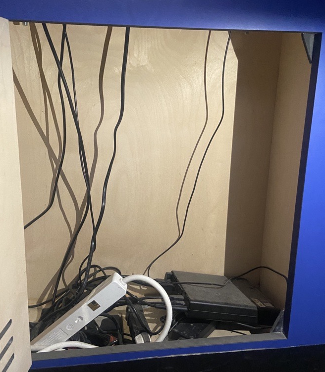

# Centre Des Sciences

Source: [Centre des Sciences](https://www.centredessciencesdemontreal.com/)

## Lieu de la visite:  
**Centre Des Sciences**

*2 Rue de la Commune O, Montréal, Qc, Canada*

**Date de la visite:** *10/4/24*

## Informations

**Titre de l'oeuvre:** *Intelligente, la conduite?*

**Nom de l'artiste:** *Ubisoft*

**Type d'exposition:** *Intérieure*

**Année de réalisation:** *2024?*

**Type d'installation:** *Interactive*

## Description de l'oeuvre

*Intelligente, la conduite?* est une oeuvre interactive qui nous fait explorer le monde de la conduite. Nous sommes apportés à choisir la voiture et les commandes désirées, et lorsque le jeu commence, la voiture conduit seule, selon les réglages choisis au début. Lorsque la voiture s'arrête et a fini de conduire, un commentaire "style de conduite" nous est attribué. Le but de cette oeuvre est de récompenser la bonne conduite et décourager la mauvaise. 

 

## Mise en espace

Cette oeuvre est située dans une pièce fermée au milieu d'une grande salle du Centre des Sciences.

 

## Composantes et techniques

Pour cette oeuvres, les composantes étaient majoritairement composées de haut-parleurs, de projecteurs, ainsi que beaucoup de câbles.

 

## Éléments nécessaires à la mise en exposition

Pour cette oeuvre, les éléments nécessaires à la mise en exposition étaient une télévision où nous pouvions visionner notre voiture conduire seule et un écran tactile posé sur une structure nous permettant de choisir nos réglages.

## Expérience vécue
J'ai beaucoup aimé cette oeuvre. J'adore les voitures et conduire en général et je dois l'avouer, je ne suis pas toujours prudente sur la route... Disons que j'aime les sensations fortes. Mais cette oeuvre m'a permis de voir certains impacts que ma conduite peut avoir sur les autres (même si mes réflexes sont bons, ça ne veut pas dire que ceux des autres qui partagent la route avec moi le sont également). Cela m'a permis d'examiner ma propre conduite et me sensibiliser à conduire plus prudemment. J'ai aussi aimé le concept relié à l'intelligence artificielle qui aujourd'hui fait beaucoup présence dans notre vie. Cela nous apporte à poser certaines questions comme : Est-ce vraiment une bonne idée la conduite automatique ? Est-ce qu'un jour les voitures ne seront conduites que par l'intelligence artificielle ? Est-ce que cela évitera vraiment la majorité des accidents ? Je trouve que malgré le fait que cette oeuvre peut être considérée comme un petit jeu enfantin, elle fait remonter plusieurs questions importantes concernant notre avenir vis à vis le monde de la conduite.

*Bonus, voici mon résultat:*

