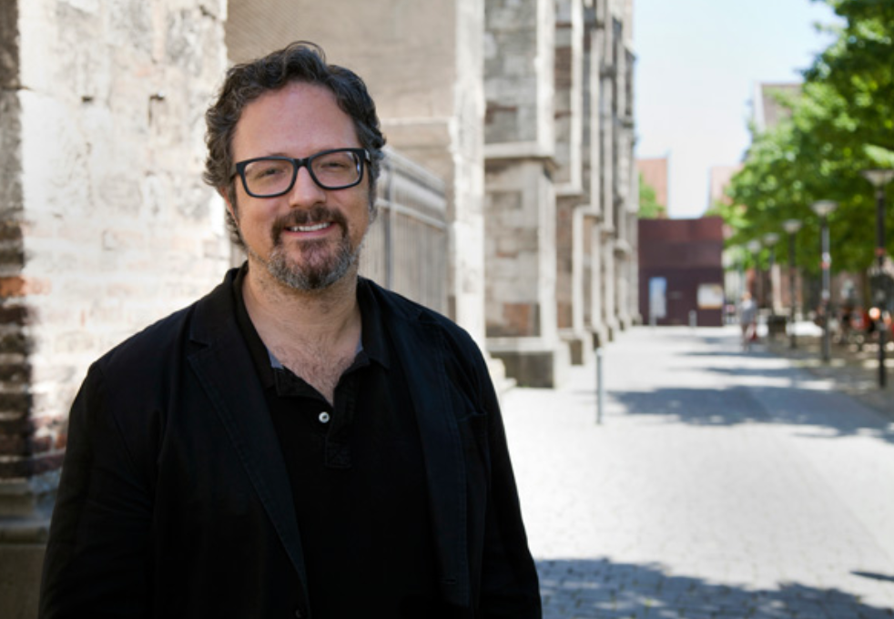
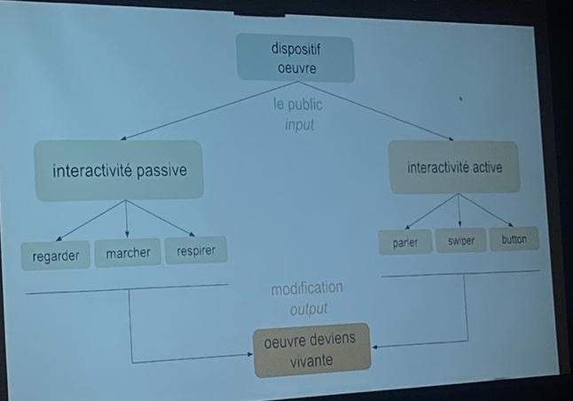
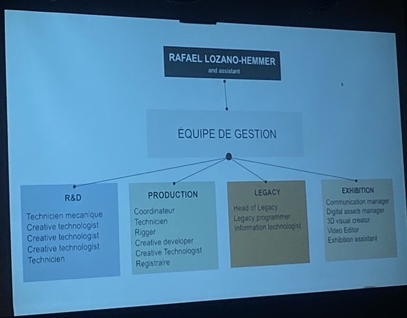
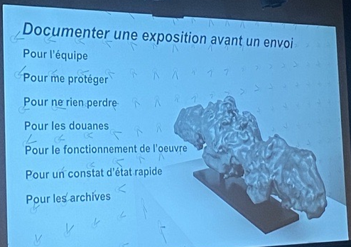
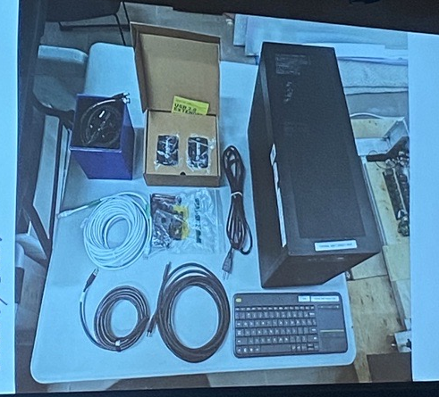
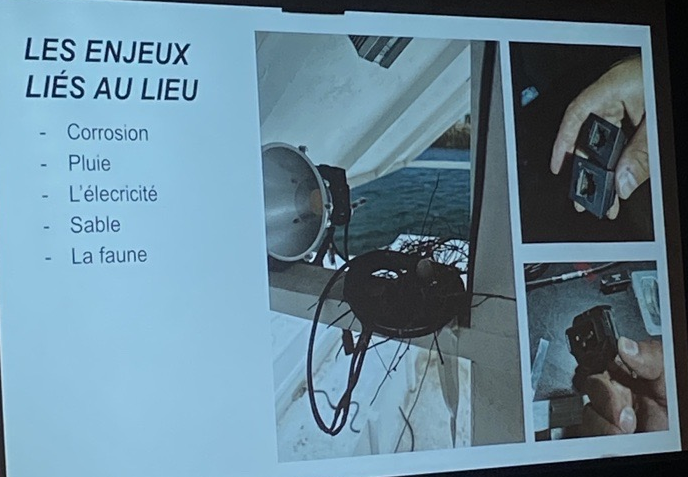

# Conférence - Studio Antimodular

## Introduction
Dans le cadre de notre technique, nous avons assisté à une conférence donnée par Jade Seguela, registraire du Studio Antimodular, dirigé par Rafael Lozano-Hemmer. Dans la conférence, on nous a expliqué plusieurs étapes importantes lorsque l'on voyage des dispositifs multimédias à travers le monde.

## Studio Antimodular - Rafael Lozano-Hemmer

Source: [Rafael Lozano-Hemmer Bio](https://www.lozano-hemmer.com/bio.php)

Rafael Lozano-Hemmer, l'artiste principal du Studio Antimodular, désire concevoir des dispositifs intéractifs avec son public. Comme il le dit lui-même: *"Beaucoup de mes oeuvres sont activées par des caméras, des capteurs ou des microphones qui captent l'activité du public, et cela devient alors l'oeuvre d'art elle-même. Donc si vous n'avez pas de public, il n'y a rien à montrer."*

## L'oeuvre

## L'équipe de gestion
Le Studio Antimodular a été conçu en 2003 et compte une équipe de 26 personnes à temps plein, des employés de 10 pays différents - architectes, programmeurs, artistes, scientifiques, écrivains, designers et musiciens.

## Documentation
Mme Seguela nous explique aussi en quoi son poste de registraire consiste. En tant que registraire, elle s'occupe de tout ce qui concerne le transport des dispositifs de pays en pays. Elle nous explique l'importance de la documentation avant d'envoyer les différents composants outre mer.

 

## Enjeux
Mme Seguela nous a également fait part des enjeux rencontrés lors d'une des expositions en Abou Dabi. En effet, transporter une oeuvre multimédia dans le désert, plus difficile que ce que l'on pense ! Et oui, avec la chaleur, le sable, la pluie et les insectes, il me semble presqu'impossible de monter une oeuvre multimédia à l'extérieur mais Mme Seguela m'a prouvé le contraire ! Elle et son équipe ont réussi à surmonter tous ces enjeux et avoir son oeuvre prête à être présentée à temps.

# Conclusion
