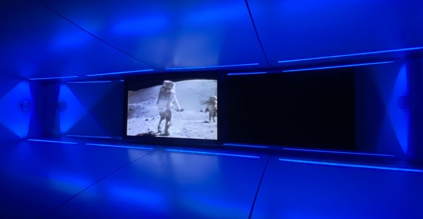
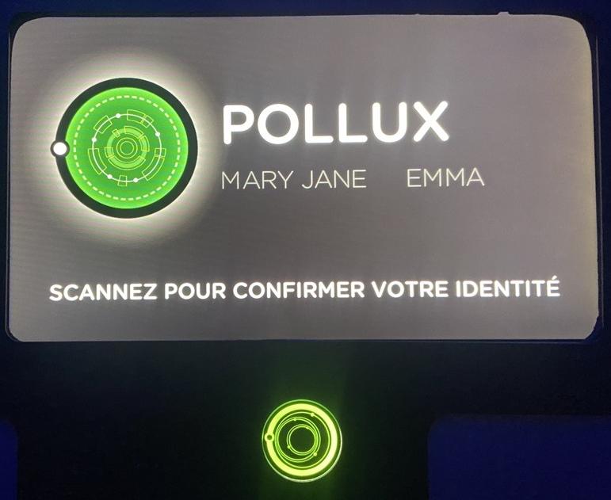
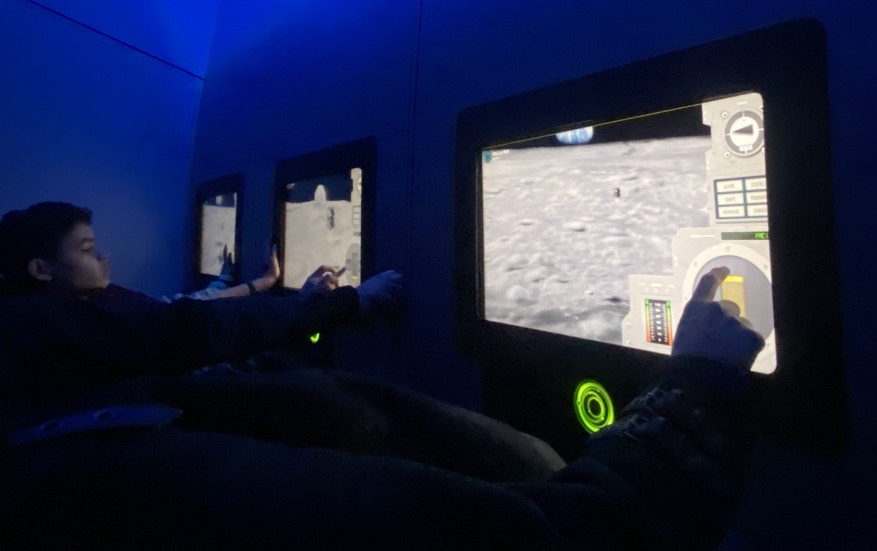
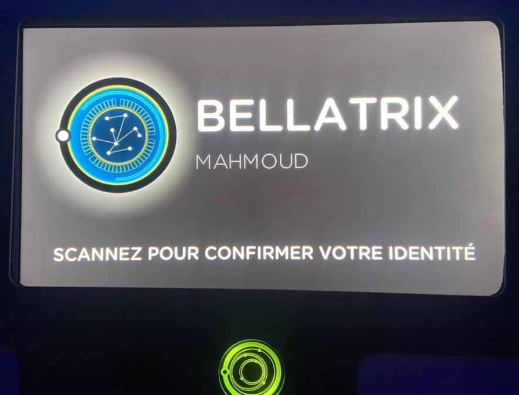
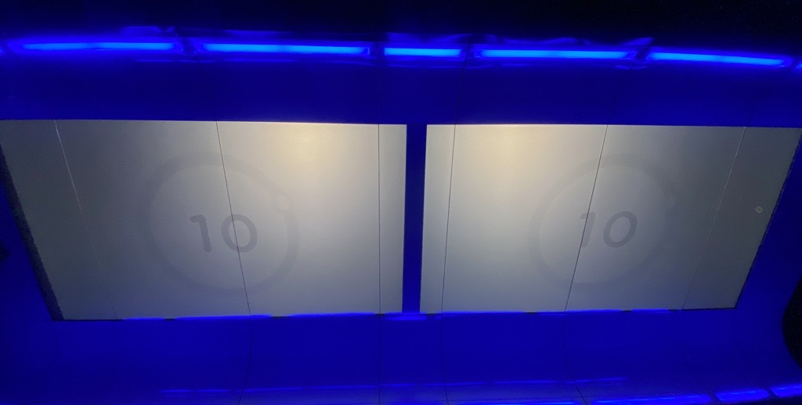

# Cosmodôme
## Mission virtuelle: Le Rêve Impossible

Source: [Cosmodôme](https://cosmodome.org/activites-familiale/missions-virtuelles/)

## Lieu de la visite:  
**Cosmodôme**

*2150 Autoroute des Laurentides, Laval, Qc, Canada*

**Date de la visite:** *7/3/24*

## Informations

**Titre de l'oeuvre:** *Le Rêve Impossible*

**Nom de l'artiste:** *Cosmodôme*

**Type d'exposition:** *Intérieure*

**Année de réalisation:** *2024?*

**Type d'installation:** *Interactive*

**Fonction du dispositif multimédia:** *Support pédagogique*

## Description de l'oeuvre

Le Rêve Impossible est une oeuvre immersive qui nous plonge dans l'aventure de la première visite sur la Lune en 1969. L'activité se déroule dans 6 pièces différentes et nous restons dans chacune des pièces pendant 10 minutes.

La première pièce ressemble à une très petite salle de cinéma, nous nous asseyons et une vidéo de 10 minutes nous présente la phase de préparation précédent le départ officiel sur la lune. On nous montre même les fois où les tentatives ont échoué.

Les 4 pièces suivantes consistent de jeux intéractifs où nous devenons en charge de toute la procédure avant, pendant et après l'atterrissage sur la lune.

  

Finalement, la dernière pièce ressemble grandement à la première, où une dernière vidéo nous présente le parcours jusqu'à la lune, ainsi que tous les échecs, menant à la mort tragique de plusieurs astronautes.

## Mise en espace

La première et la dernière pièce sont conçues de bancs faisant la largeur de la pièce, ainsi que d'un écran faisant également la largeur de la pièce, permettant de nous jouer la vidéo.

Les autres pièces sont conçues de tables intéractives et de petits écrans nous permettant d'intéragir avec les jeux mis en place.

## Composantes et techniques

Chacun des participants reçoivent un bracelet qui nous permettent de nous créer des avatars pour les jeux. En équipe de deux, nous nous choisissons une planète et lorsque vient le temps de jouer, nous scannons nos bracelets pour nous identifier.

Il y a également tous les écrans, intéractifs ou non qui sont utilisés comme technique de projection ou intéraction.

## Éléments nécessaires à la mise en exposition

Les écrans, les projecteurs, les lumières et les bancs sont tous des éléments nécessaires à la mise en exposition.

## Expérience vécue

J'ai beaucoup apprécié mon expérience. Je suis déjà passionnée par l'astronomie alors j'ai surtout apprécié les vidéos documentant toute l'aventure de l'atterrissage sur la lune. J'ai aussi apprécié la façon dont les vidéos ont été narratées, j'ai vraiment été plongée dans l'émotion lorsqu'ils ont parlé des échecs menant à la mort de beaucoup d'astronautes. J'ai aussi bien apprécié les jeux, je trouve que c'était amusant de devenir en charge de toute cette aventure. Le seul point négatif que j'aurais à donner serait que certains jeux étaient trop courts pour les 10 minutes que nous devions passer dans la pièce. Par exemple, le jeu où nous devions faire atterrir la fusée sur la lune, un essai nous prenait environ 30 secondes. J'ai donc trouvé cela un peu long de refaire le même jeu 20 fois...
