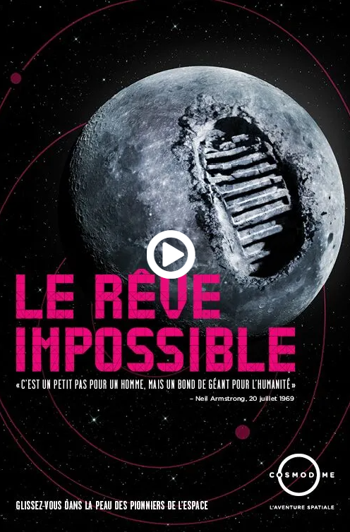

# Cosmodôme
## Mission virtuelle: Le Rêve Impossible

Source: [Cosmodôme](https://cosmodome.org/activites-familiale/missions-virtuelles/)

## Lieu de la visite:  
**Cosmodôme**

*2150 Autoroute des Laurentides, Laval, Qc, Canada*

**Date de la visite:** *7/3/24*

## Informations

**Titre de l'oeuvre:** *Le Rêve Impossible*

**Nom de l'artiste:** *Cosmodôme*

**Type d'exposition:** *Intérieure*

**Année de réalisation:** *2024?*

**Type d'installation:** *Interactive*

**Fonction du dispositif multimédia:** *Support pédagogique*

## Description de l'oeuvre

Le Rêve Impossible est une oeuvre immersive qui nous plonge dans l'aventure de la première visite sur la Lune en 1969. L'activité se déroule dans 6 pièces différentes et nous restons dans chacune des pièces pendant 10 minutes.

La première pièce ressemble à une très petite salle de cinéma, nous nous asseyons et une vidéo de 10 minutes nous présente la phase de préparation précédent le départ officiel sur la lune. On nous montre même les fois où les tentatives ont échoué.

Les 4 pièces suivantes consistent de jeux intéractifs où nous devenons en charge de toute la procédure avant, pendant et après l'atterrissage sur la lune.

Finalement, la dernière pièce ressemble grandement à la première, où une dernière vidéo nous présente le parcours jusqu'à la lune, ainsi que tous les échecs, menant à la mort tragique de plusieurs astronautes.

## Mise en espace

## Composantes et techniques

## Éléments nécessaires à la mise en exposition

## Expérience vécue
