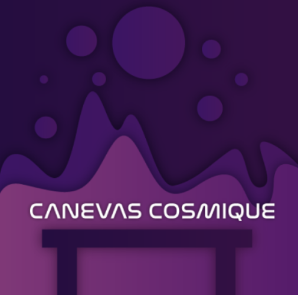

# Crescentia

Source: [TIM - Collège Montmorency](https://tim-montmorency.com/2024/)

## Lieu de la visite:  
**Collège Montmorency**

*475 Boul De L'avenir, Laval, Qc, Canada*

**Dates des visites:** *21/23/24 et 13/3/24*

## Informations

**Titre de l'oeuvre:** *Crescentia - Cosmique*

**Nom de l'artiste:** *Élèves finissants du programme TIM*

**Type d'exposition:** *Intérieure*

**Année de réalisation:** *2024*

**Type d'installation:** *Intéractive*

**Fonction du dispositif multimédia:** *Support pédagogique*

## Description de l'oeuvre
*Cosmique* est une oeuvre composée d'une table sur laquelle reposent des 5 statuettes. Ces 5 statuettes représentent un évènement spacial différent (ex: éruption solaire). Au centre de la table se trouve une projection d'un soleil. Lorsqu'une des statuettes est bougée sur la table, l'évènement auquel il correspond apparaît sur l'écran en face de la table.

## Mise en espace

## Composantes et techniques

## Éléments nécessaires à la mise en exposition

## Expérience vécue
