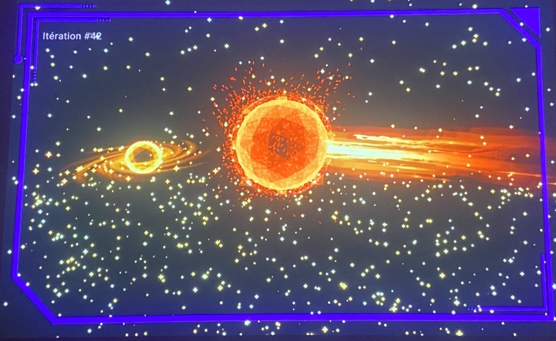
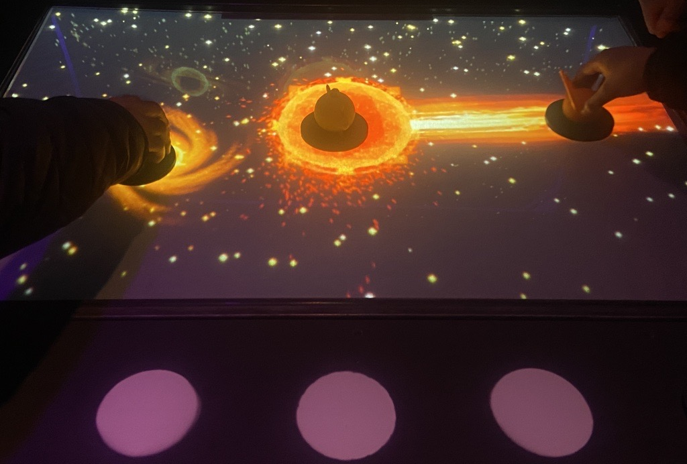
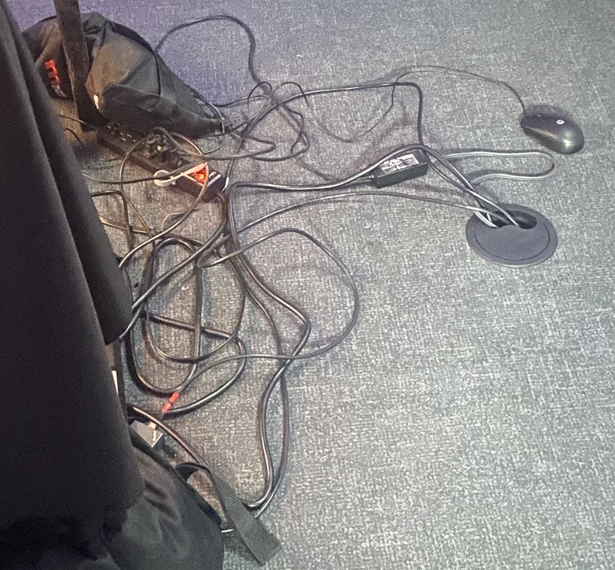
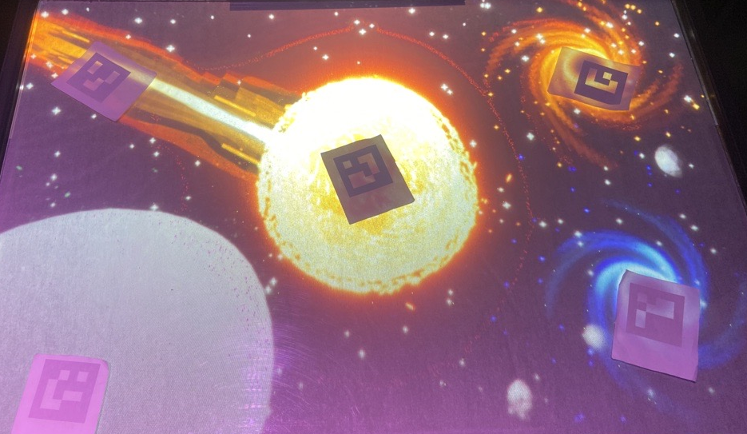

# Crescentia

Source: [TIM - Collège Montmorency](https://tim-montmorency.com/2024/)

## Lieu de la visite:  
**Collège Montmorency**

*475 Boul De L'avenir, Laval, Qc, Canada*

**Dates des visites:** *21/23/24 et 13/3/24*

## Informations

**Titre de l'oeuvre:** *Crescentia - Cosmique*

**Nom de l'artiste:** *Élèves finissants du programme TIM*

**Type d'exposition:** *Intérieure*

**Année de réalisation:** *2024*

**Type d'installation:** *Intéractive*

**Fonction du dispositif multimédia:** *Support pédagogique*

## Description de l'oeuvre
Cosmique est une oeuvre composée d'une table sur laquelle reposent des 5 statuettes. Ces 5 statuettes représentent un évènement spacial différent (ex: éruption solaire). Au centre de la table se trouve une projection d'un soleil. Lorsqu'une des statuettes est bougée sur la table, l'évènement auquel il correspond apparaît sur l'écran en face de la table et réagit avec ou autour du soleil.

 

## Mise en espace
Cosmique était situé directement devant la porte du grand studio. Cette oeuvre ne prenait pas beaucoup d'espace et donc était positionné dans le coin.

## Composantes et techniques
Pour Cosmique, les composantes étaient majoritairement des haut-parleurs, une switch, des cables, un ordinateur et des projecteurs.

 

## Éléments nécessaires à la mise en exposition
Les éléments nécessaires à la mise en exposition de cette oeuvre était une table où reposaient les statuettes ainsi qu'une toile sur laquelle projetaient les animations astronomiques.

## Expérience vécue
J'ai beaucoup apprécié cette oeuvre. C'était de loin ma favorite. Étant passionnée par l'astronomie, les évènements de ce genre m'ont toujours fascinée et je trouve que la qualité visuelle et sonore étaient excellentes. J'ai beaucoup aimé la façon dont les élèves ont exploité leur concept.
