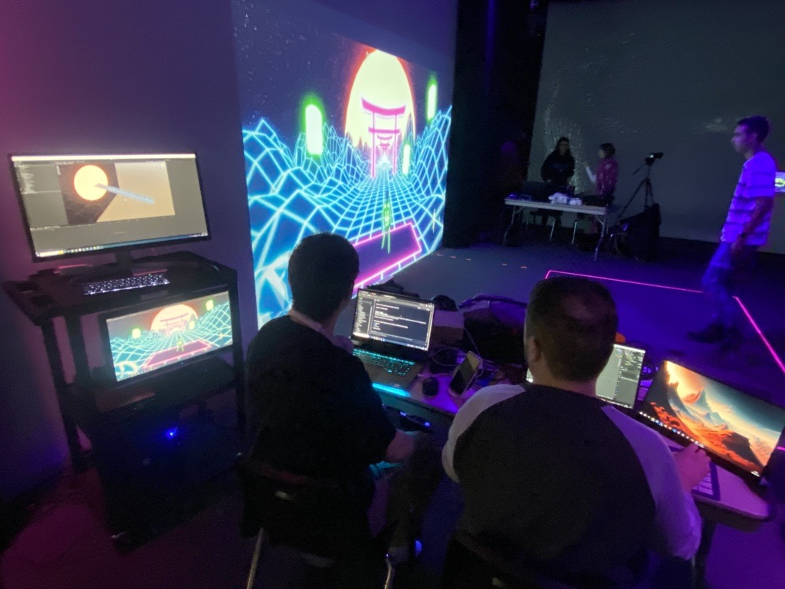
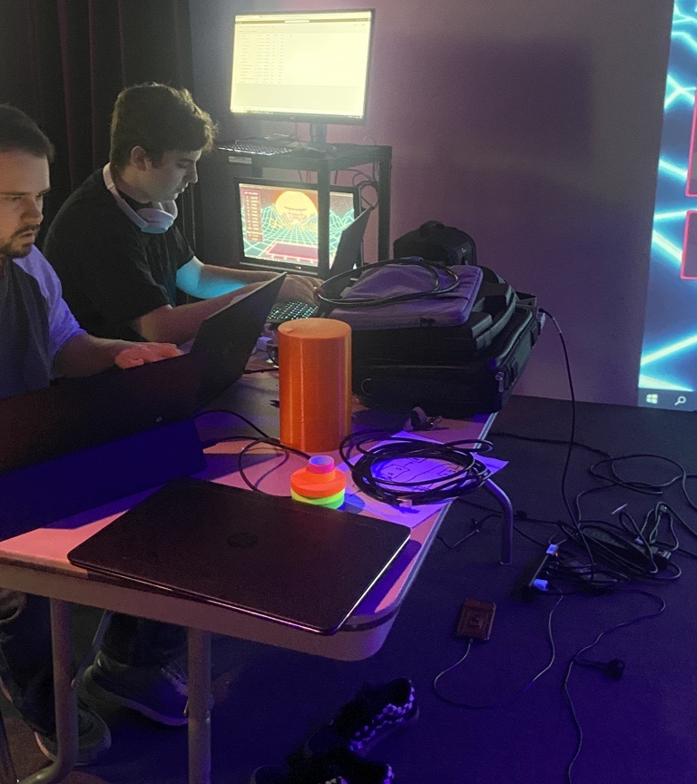
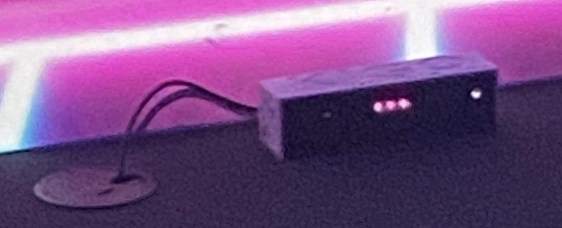
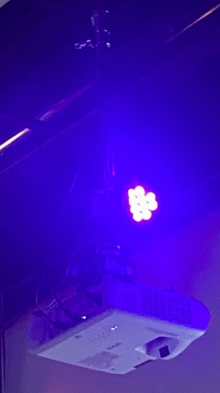

# Crescentia

Source: [TIM - Collège Montmorency](https://tim-montmorency.com/2024/)

## Lieu de la visite:  
**Collège Montmorency**

*475 Boul De L'avenir, Laval, Qc, Canada*

**Dates des visites:** *21/23/24 et 13/3/24*

## Informations

**Titre de l'oeuvre:** *Crescentia - Kigo*

**Nom de l'artiste:** *Élèves finissants du programme TIM*

**Type d'exposition:** *Intérieure*

**Année de réalisation:** *2024*

**Type d'installation:** *Intéractive*

**Fonction du dispositif multimédia:** *Support pédagogique*

## Description de l'oeuvre
Kigo est un jeu vidéo où nous devons jouer avec notre corps. Nous devons éviter des obstacles ainsi qu'accumuler des points. Nous pouvons jouer en équipe de deux ou seul.

## Mise en espace
Kigo était positionné vis à vis le mur gauche du grand studio. Comme l'oeuvre prenait beaucoup de place, la majorité du mur lui était accordé ainsi qu'une plateforme désignée au sol où les spectateurs se plaçaient pour jouer.

## Composantes et techniques
Pour Kigo, les composantes étaient majoritairement des haut-parleurs, une kinect, des cables, un ordinateur et des projecteurs.

  

## Éléments nécessaires à la mise en exposition
Les éléments nécessaires à la mise en exposition de cette oeuvre étaient une kinect pour les mouvements du corps ainsi qu'une projection pour le jeu.

## Expérience vécue
J'ai beaucoup aimé cette oeuvre, je l'ai trouvée très amusante et divertissante. Je trouve qu'elle s'est beaucoup démarquée des autres oeuvres, en partie car c'est la seule où nous devions bouger notre corps complet pour jouer. J'ai aussi aimé que ce soit la seule oeuvre qui nous donnait un but, une raison de participer, contrairement aux autres où le seul but était d'avoir un résultat visuel. Le seul point négatif était que la kinect ne prenait pas bien la couleur noire et comme je suis toujours habillée en noir, mon bonhomme avait l'air de faire une crise d'épilepsie... Mais bon, ça nous a donné de bons fous rires.
