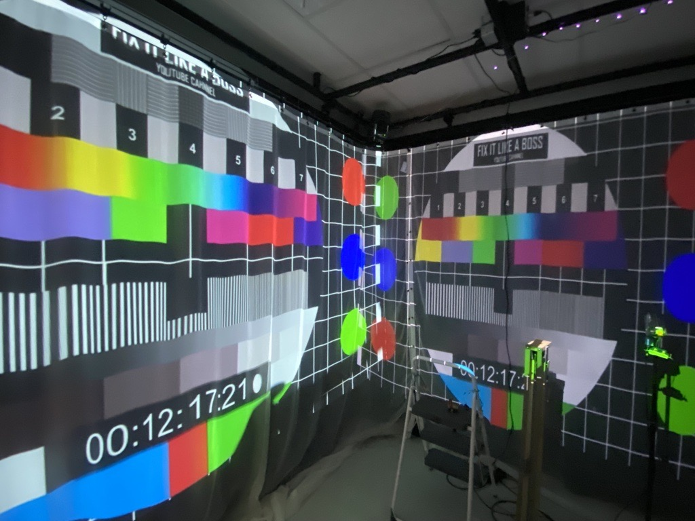
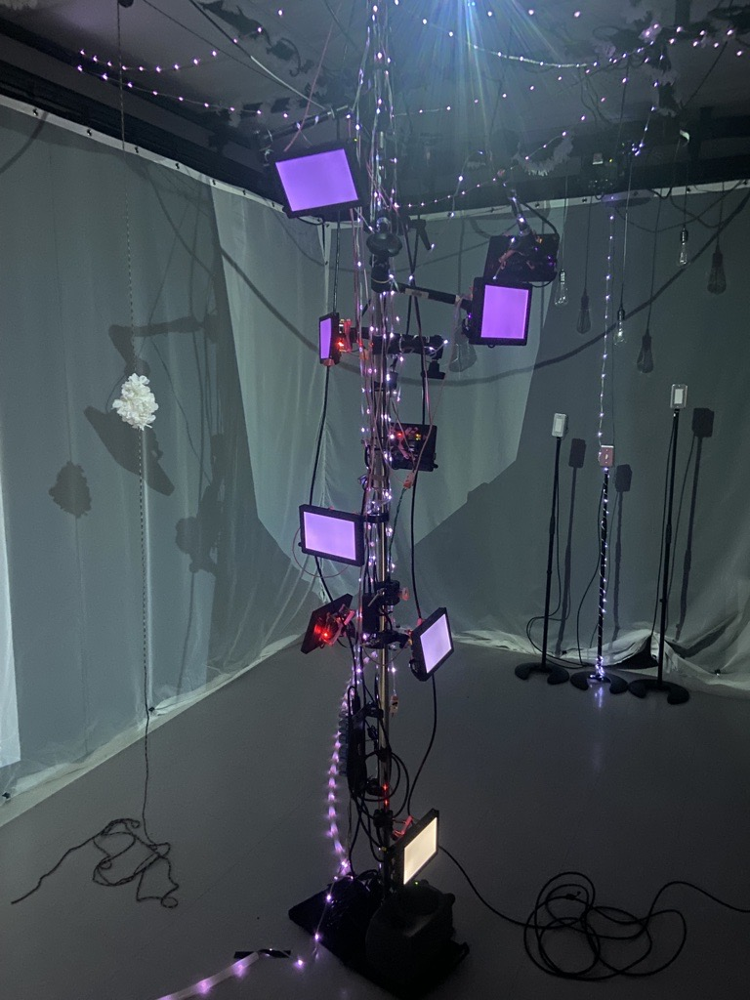
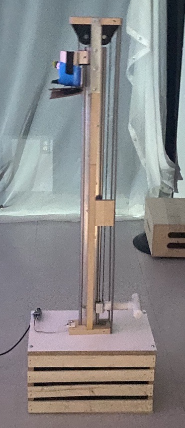

# Crescentia

Source: [TIM - Collège Montmorency](https://tim-montmorency.com/2024/)

## Lieu de la visite:  
**Collège Montmorency**

*475 Boul De L'avenir, Laval, Qc, Canada*

**Dates des visites:** *21/23/24 et 13/3/24*

## Informations

**Titre de l'oeuvre:** *Crescentia - Papillon*

**Nom de l'artiste:** *Élèves finissants du programme TIM*

**Type d'exposition:** *Intérieure*

**Année de réalisation:** *2024*

**Type d'installation:** *Intéractive*

**Fonction du dispositif multimédia:** *Support pédagogique*

## Description de l'oeuvre
Papillon est une oeuvre représentant le cycle de vie d'un arbre, plus précisément, d'un pommier. Les spéctateurs sont encouragés à toucher et manipuler tous les composantes manipulables dans la pièce afin de découvrir les conséquences de chacune des actions présentées.

## Mise en espace
Papillon était située dans le petit studio et occupait sa largeur au complet car cette oeuvre avait beaucoup plus de matériel que toutes les autres oeuvres.

## Composantes et techniques
Pour Papillon, les composantes étaient majoritairement des haut-parleurs, des petits écrans, beaucoup de cables et un ordinateur.
 

## Éléments nécessaires à la mise en exposition
Beaucoup d'éléments étaient présents dans la pièce. Des écrans composants le corps de l'arbres, où nous était projeté des vidéos du cycle de vie de l'arbre lorsque certains éléments étaient manipulés, une valve, des boutons, une ampoule, etc.

## Expérience vécue
J'ai apprécié cette oeuvre car j'ai beaucoup aimé le concept, toutefois, elle me rendait très confuse. Je ne savais pas par où commencer, quel objet toucher, quel objet ne pas toucher, où regarder lorsque je touchais un objet... Je pense que cette oeuvre aurait eu besoin de plus d'encadrement pour guider le spectateur dans son aventure. Comme l'oeuvre prenait beaucoup d'espace, il était difficile de ne pas se perdre parmi toutes ses composantes.
