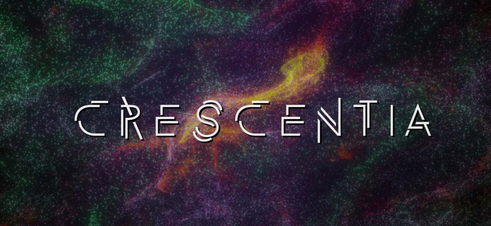

# Crescentia

Source: [TIM - Collège Montmorency](https://tim-montmorency.com/2024/)

## Lieu de la visite:  
**Collège Montmorency**

*475 Boul De L'avenir, Laval, Qc, Canada*

**Dates des visites:** *21/23/24 et 13/3/24*

## Informations

**Titre de l'oeuvre:** *Crescentia - Papillon*

**Nom de l'artiste:** *Élèves finissants du programme TIM*

**Type d'exposition:** *Intérieure*

**Année de réalisation:** *2024*

**Type d'installation:** *Intéractive*

**Fonction du dispositif multimédia:** *Support pédagogique*

## Description de l'oeuvre
Papillon est une oeuvre représentant le cycle de vie d'un arbre, plus précisément, d'un pommier. Les spéctateurs sont encouragés à toucher et manipuler tous les composantes manipulables dans la pièce afin de découvrir les conséquences de chacune des actions présentées.

## Mise en espace
Papillon était située dans le petit studio et occupait sa largeur au complet car cette oeuvre avait beaucoup plus de matériel que toutes les autres oeuvres.

## Composantes et techniques
Pour Rhizomatique, les composantes étaient majoritairement des haut-parleurs, une kinect, des cables, un ordinateur et des projecteurs.

## Éléments nécessaires à la mise en exposition

## Expérience vécue
