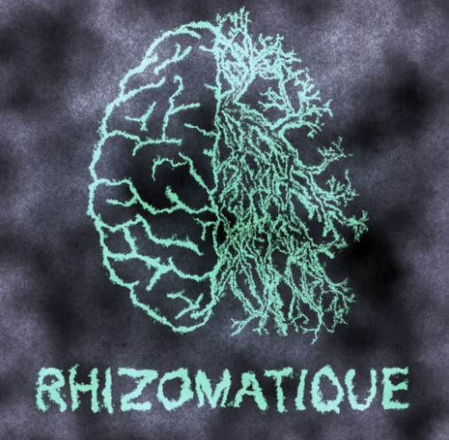
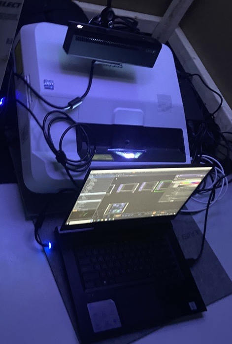
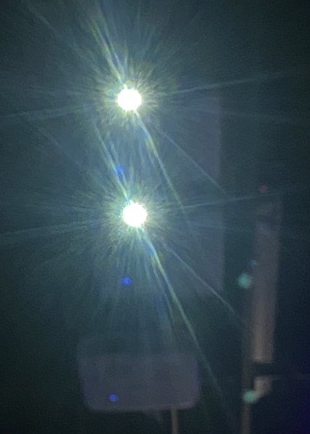
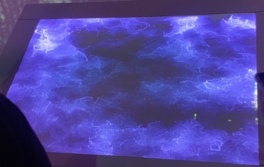

# Crescentia

Source: [TIM - Collège Montmorency](https://tim-montmorency.com/2024/)

## Lieu de la visite:  
**Collège Montmorency**

*475 Boul De L'avenir, Laval, Qc, Canada*

**Dates des visites:** *21/23/24 et 13/3/24*

## Informations

**Titre de l'oeuvre:** *Crescentia - Rhizomatique*

**Nom de l'artiste:** *Élèves finissants du programme TIM*

**Type d'exposition:** *Intérieure*

**Année de réalisation:** *2024*

**Type d'installation:** *Intéractive*

**Fonction du dispositif multimédia:** *Support pédagogique*

## Description de l'oeuvre
Rhizomatique est une oeuvre qui explore les souvenirs du cerveau humain. Celui-ci est représenté par une toile. Lorsque cette toile est touchée, des souvenirs sont projetés sur l'écran en face de nous.

## Mise en espace
Rhizomatique était situé dans le grand studio, dans le cyclorama. L'oeuvre prenait toute la largeur du cyclorama.

## Composantes et techniques
Pour Rhizomatique, les composantes étaient majoritairement des haut-parleurs, une kinect, des cables, un ordinateur et des projecteurs.

 

## Éléments nécessaires à la mise en exposition
Les éléments nécessaires à la mise en exposition pour Rhizomatique était une toile, une structure pour tenir la toile ainsi que le cyclorama situé dans le grand studio.

## Expérience vécue
Je n'ai pas spécialement apprécié cette oeuvre car je trouve que ça devenait très redondant rapidement. L'intérêt est présent au début mais une fois que la toile est touchée une fois, on perd de l'intérêt rapidement. La qualité de la projection était aussi très mauvaise, ce qui peut être expliqué par l'endroit où l'oeuvre était situé mais je trouve que dû à cette mauvaise qualité de projection, l'oeuvre perdait aussi de la valeur. J'aime l'idée derrière l'oeuvre, je la trouve très intéressante mais ce n'est pas de cette façon que je l'aurais exploitée.
