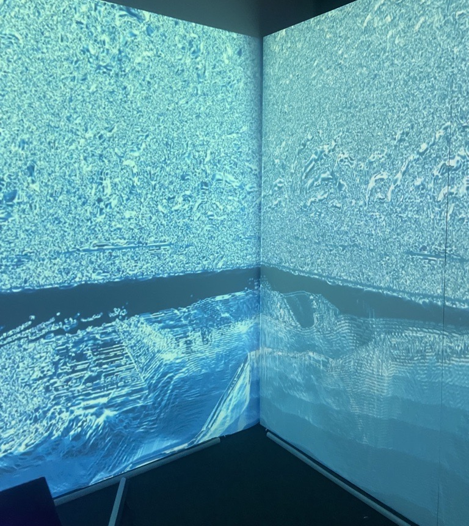
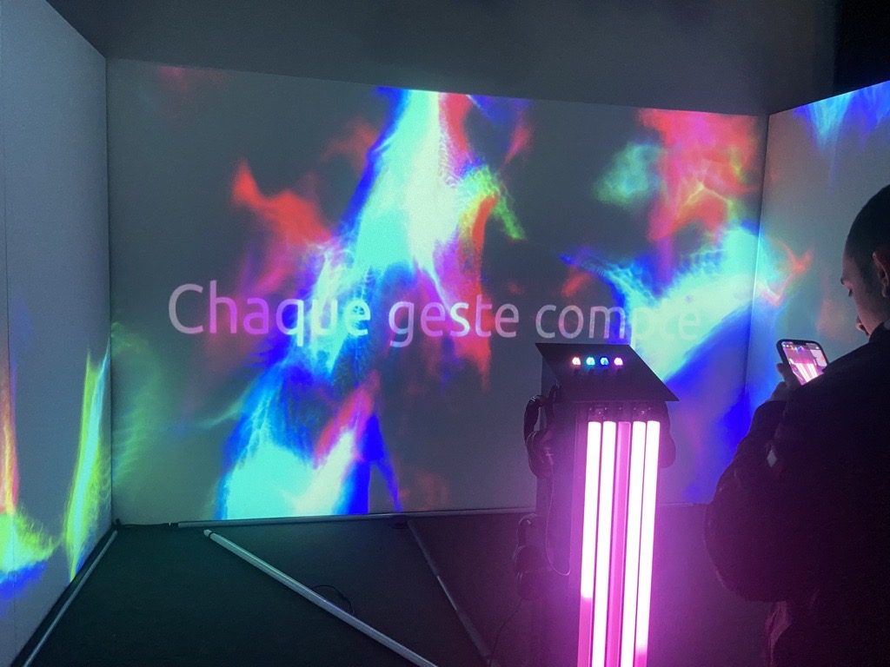
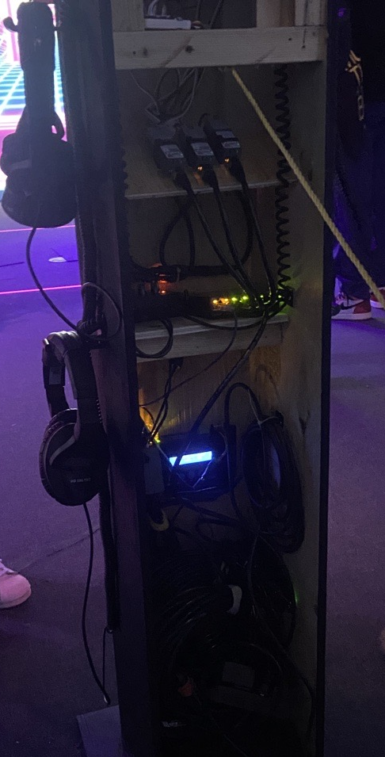
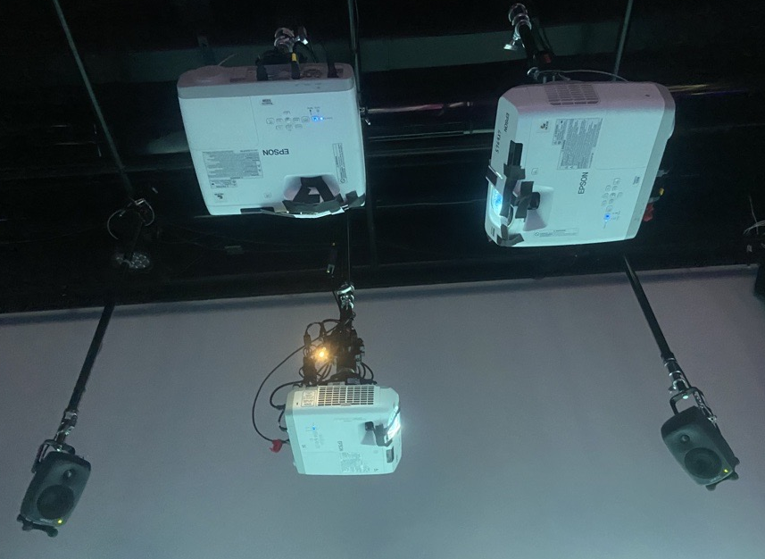
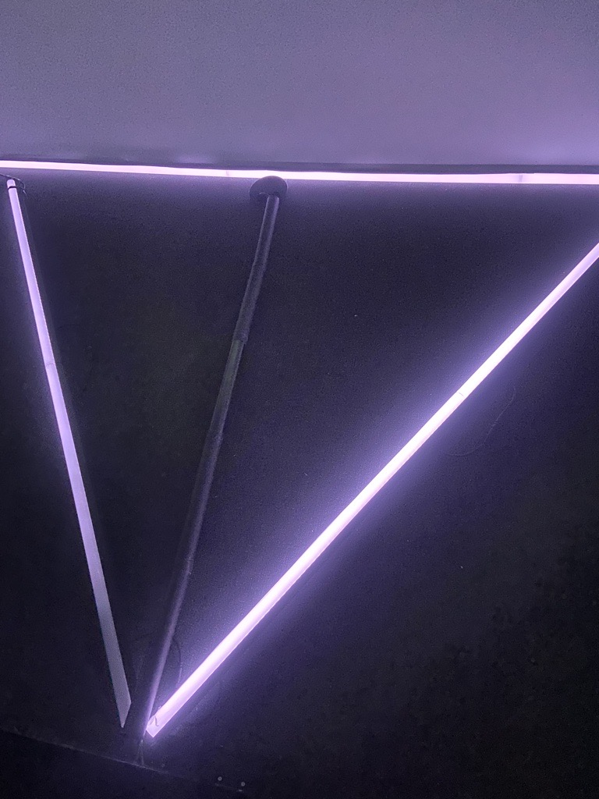
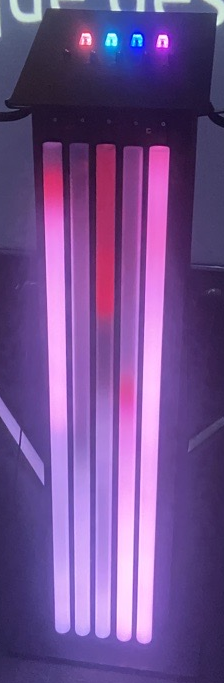
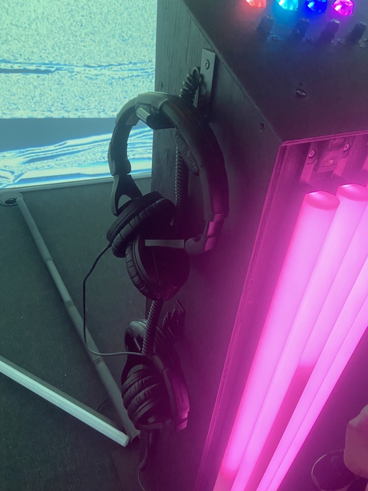

# Crescentia

Source: [TIM - Collège Montmorency](https://tim-montmorency.com/2024/)

## Lieu de la visite:  
**Collège Montmorency**

*475 Boul De L'avenir, Laval, Qc, Canada*

**Dates des visites:** *21/23/24 et 13/3/24*

## Informations

**Titre de l'oeuvre:** *Crescentia - Sonalux*

**Nom de l'artiste:** *Élèves finissants du programme TIM*

**Type d'exposition:** *Intérieure*

**Année de réalisation:** *2024*

**Type d'installation:** *Intéractive*

**Fonction du dispositif multimédia:** *Support pédagogique*

## Description de l'oeuvre
Sonalux est une oeuvre qui nous fait découvrir le monde de l'audiovisuel. Nous étions encouragés à contrôler via une console, tous les différents sons entendus ainsi que les animations projetées.

## Mise en espace
Sonalux était situé sur le mur droit du grand studio.

## Composantes et techniques
Pour Rhizomatique, les composantes étaient majoritairement des haut-parleurs, des casques d'écoute, des cables, un ordinateur et des projecteurs.

 

## Éléments nécessaires à la mise en exposition
Les éléments nécessaires à la mise en exposition pour Sonalux étaient une console avec les boutons nous permettant de contrôler le son et les animations, une structure où repose cette console, des bâtons lumineux ainsi que le mur où les animations étaient projetées.

  

## Expérience vécue
J'ai apprécié cette oeuvre car le concept était original, toutefois, une fois que les boutons ont été explorés, je me lassais très vite. Je trouve que les actions étaient trop limitées pour que l'amusement dure longtemps. Malgré que le concept était intéressant, je n'ai pas éprouvé plus d'intérêt pour cette oeuvre que pour les autres.
