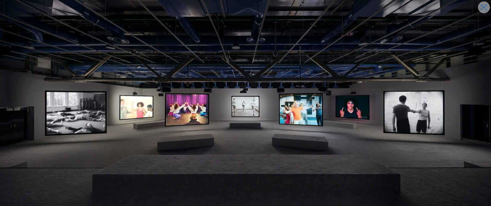
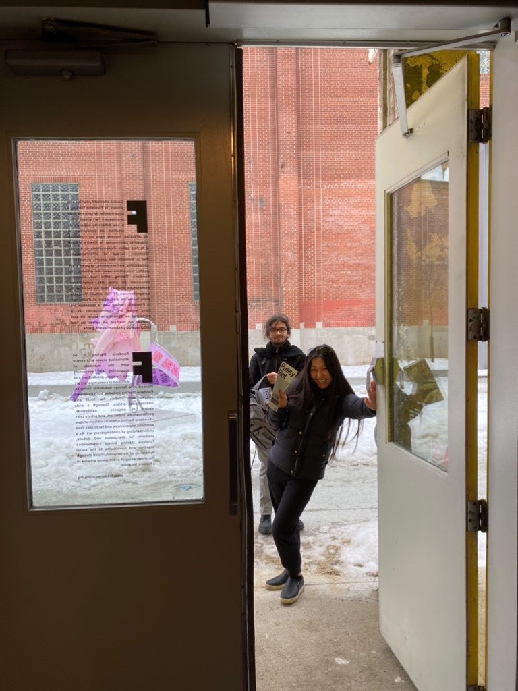
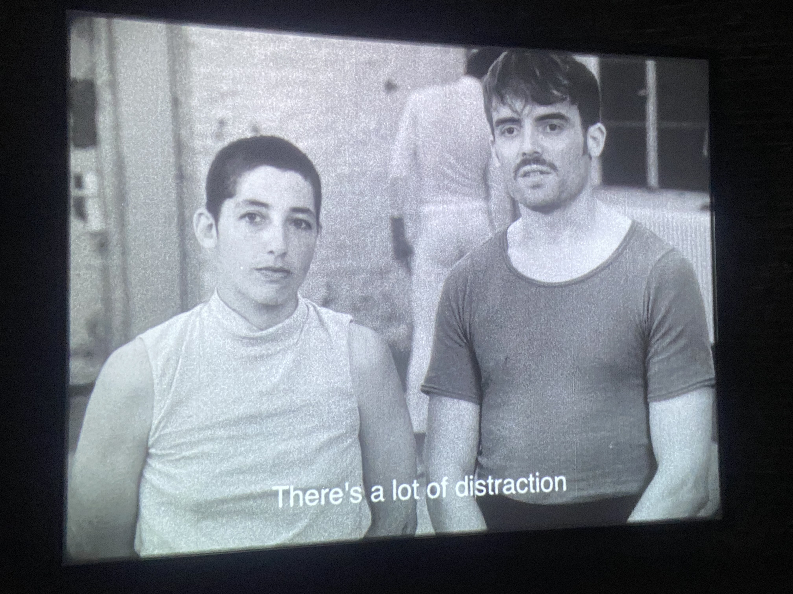
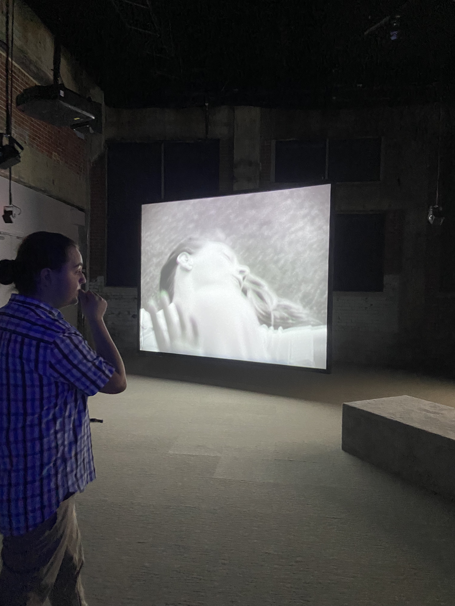
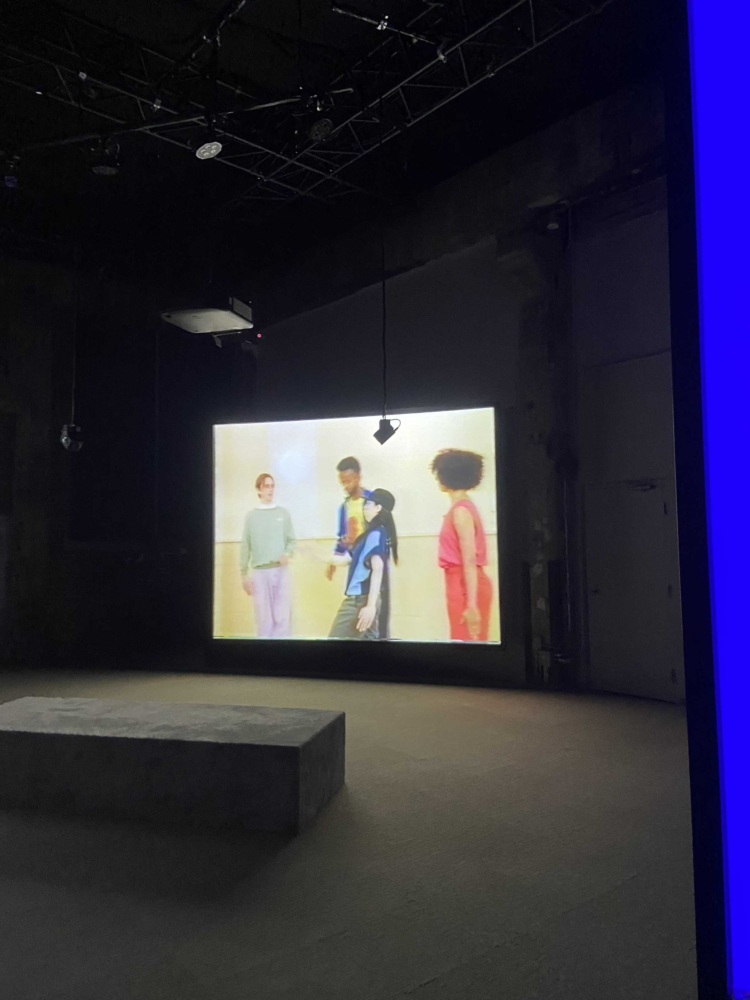
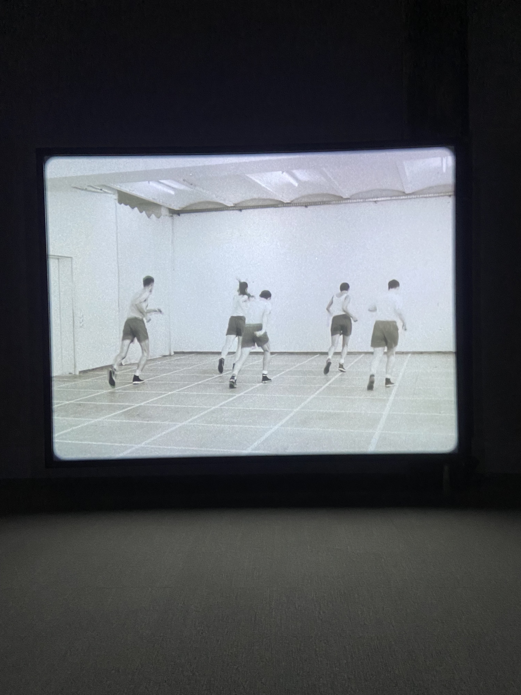
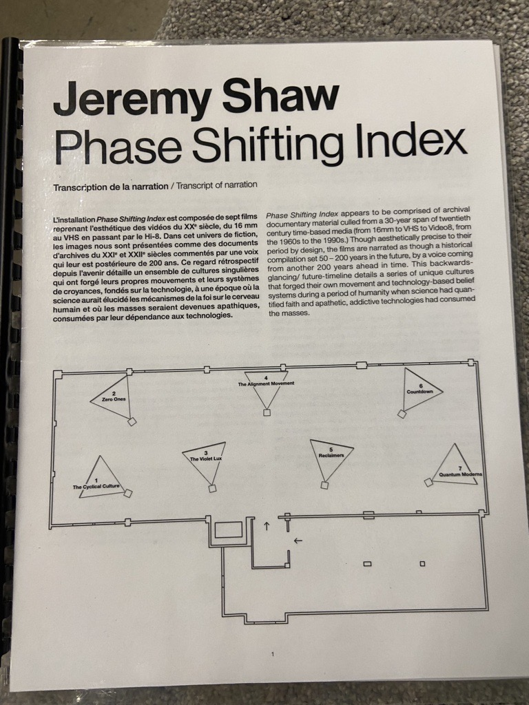
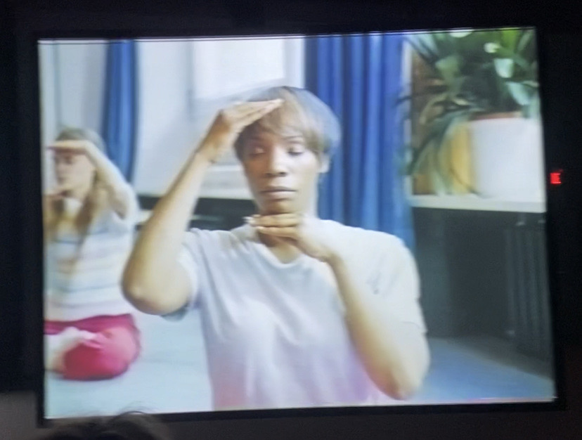
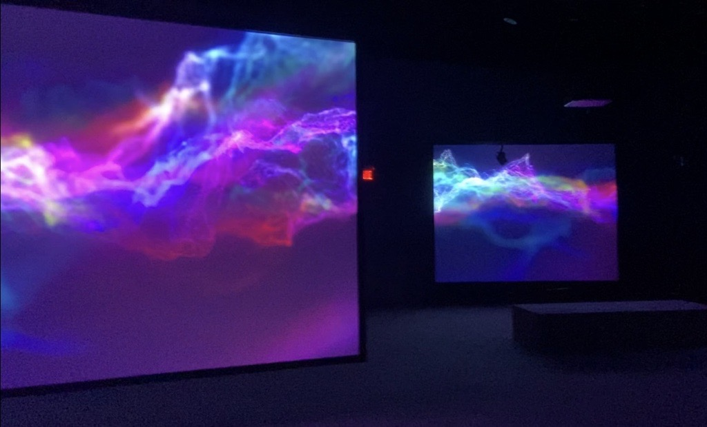

<h1>JEREMY SHAW</h1>
<h2>Phase Shifting Index</h2>

Fonderie Darling  
745 Rue Ottawa, Montréal QC H3C 1R8  

Date de la visite: 31/1/24  
 
<h1>INFORMATIONS</h1>
Type d'exposition: intérieure  
Titre de l'oeuvre: Phase Shifting Index  

Nom de l'artiste: Jeremy Shaw  
Année de réalisation: 2020  
Type d'installation: immersive  
[Aperçu](https://cmontmorency365-my.sharepoint.com/:v:/g/personal/1955251_cmontmorency_qc_ca/ERmb_d85qvdFvlTXMMebfzAB4YderYE_GS_nO2l10Lg-CA?nav=eyJyZWZlcnJhbEluZm8iOnsicmVmZXJyYWxBcHAiOiJTdHJlYW1XZWJBcHAiLCJyZWZlcnJhbFZpZXciOiJTaGFyZURpYWxvZy1MaW5rIiwicmVmZXJyYWxBcHBQbGF0Zm9ybSI6IldlYiIsInJlZmVycmFsTW9kZSI6InZpZXcifX0%3D&email=1955251%40cmontmorency.qc.ca&e=sOwoZ5)
 
<h1>DESCRIPTION</h1>
Vaste installation vidéo immersive à sept canaux, Phase Shifting Index est une rêverie parascientifique exaltante d’une grande ambition intellectuelle et artistique, et le point culminant des travaux récents de Shaw. Dans ce qui semble être une étude anthropologique d’un futur lointain, une narration commente de manière rétrospective l’émergence de nouvelles réalités déconcertantes sur sept écrans affichant ce qui s’avère être des images d’archives de divers groupes de thérapie par le mouvement des années 60 aux années 90. Ces images sont captées dans les formats de l’époque – allant du film 16 mm au VHS en passant par le Hi-8.  
Source: [MAC](https://macm.org/en/exhibitions/jeremy-shaw/)
 
<h1>MISE EN ESPACE</h1>
L'oeuvre est exposée dans une grande salle. Chaque écran est disposé de manière aléatoire dans la salle et occupe toute l'espace disponible. Des bancs sont placés sur un des côtés de la salle pour les spectateurs.  

[Aperçu](https://cmontmorency365-my.sharepoint.com/:v:/g/personal/1955251_cmontmorency_qc_ca/EWkHn2C-auJLpNJ3WchL7nkBwnz6C7jv_RLHLo5wI239Lw?nav=eyJyZWZlcnJhbEluZm8iOnsicmVmZXJyYWxBcHAiOiJTdHJlYW1XZWJBcHAiLCJyZWZlcnJhbFZpZXciOiJTaGFyZURpYWxvZy1MaW5rIiwicmVmZXJyYWxBcHBQbGF0Zm9ybSI6IldlYiIsInJlZmVycmFsTW9kZSI6InZpZXcifX0%3D&email=1955251%40cmontmorency.qc.ca&e=gtBy4d)
 
<h1>COMPOSANTES ET TECHNIQUES</h1>
L'oeuvre est composée de plusieurs documentaires filmés et projetés sur des écrans différents. Dans les documentaires, les acteurs sont vêtus de vêtements dans le style "années 60-90".  

 
<h1>ÉLÉMENTS NÉCESSAIRES À LA MISE EN EXPOSITION</h1>
Les écrans de projections ainsi que les lumières étaient des éléments nécessaires à la mise en exposition de l'oeuvre.  

 
<h1>EXPÉRIENCE VÉCUE</h1>
L'oeuvre à laquelle nous avons été exposés ne m'a certainement pas laissée indifférente. J'ai spécialement apprécié l'approche sur les idéologies du passé et celles du présent. Je pense que cet expérience nous fait beaucoup réfléchir et nous poser certaines questions. J'ai aussi aimé comment l'oeuvre a été présentée, le fait de disperser les différentes composantes de celle-ci afin de nous faire déplacer pour les voir une à une. J'ai trouvé que cela nous donnait un rapport plus personnel avec l'oeuvre. 
 
<h1>POINTS NÉGATIFS</h1>
Les points négatifs auxquels je ferai référence sont uniquement basés sur mon opinion personnel. Je n'ai personnellement pas apprécié le jeu de lumière où tous les écrans se mettent à ("flasher") faire des éclas de lumière en même temps, cela m'a donné extrêmement mal à la tête. Je suis également très sensible à certains mouvements, donc lorsqu'il y a eu des jeux de couleurs qui bougeaient de façon étrange et se mélangeaient, cela m'a donné le ("motion sickness") mal de coeur instantanément. Évidemment, je suis consciente que beaucoup d'entre nous n'ont pas eu ce problème et que ce n'est que personnel à moi-même donc je reste subjective.  
[Lumière](https://cmontmorency365-my.sharepoint.com/:v:/g/personal/1955251_cmontmorency_qc_ca/Edu6zQi5_hhBjMpZz915RPwB6b1zJWkcmtccVZj9OZOTwQ?nav=eyJyZWZlcnJhbEluZm8iOnsicmVmZXJyYWxBcHAiOiJTdHJlYW1XZWJBcHAiLCJyZWZlcnJhbFZpZXciOiJTaGFyZURpYWxvZy1MaW5rIiwicmVmZXJyYWxBcHBQbGF0Zm9ybSI6IldlYiIsInJlZmVycmFsTW9kZSI6InZpZXcifX0%3D&email=1955251%40cmontmorency.qc.ca&e=yo6A9N)
[Couleurs](https://cmontmorency365-my.sharepoint.com/:v:/g/personal/1955251_cmontmorency_qc_ca/EWYOGjqOJYpHlAsD-cLXoOABAtQONPwG6LFJbq9z88zojw?nav=eyJyZWZlcnJhbEluZm8iOnsicmVmZXJyYWxBcHAiOiJTdHJlYW1XZWJBcHAiLCJyZWZlcnJhbFZpZXciOiJTaGFyZURpYWxvZy1MaW5rIiwicmVmZXJyYWxBcHBQbGF0Zm9ybSI6IldlYiIsInJlZmVycmFsTW9kZSI6InZpZXcifX0%3D&email=1955251%40cmontmorency.qc.ca&e=9dXZgC)
